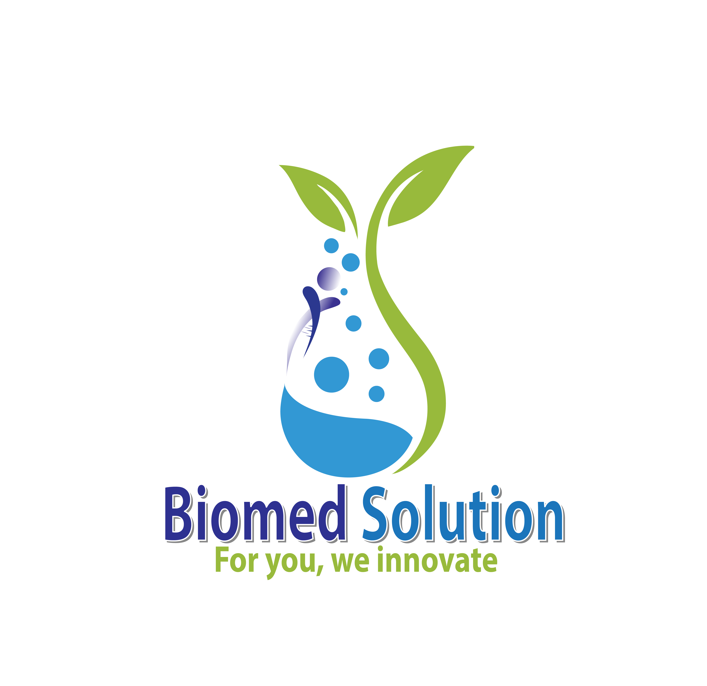

# 🏥 Biomed Solutions - Advanced Medical Equipment Website

<div align="center">
  
  
  <p align="center">
    <strong>Professional Medical Equipment Provider in Nepal</strong>
  </p>
  
  <p align="center">
    Modern, Fast, and Production-Ready Website with Admin Panel
  </p>

  <p align="center">
    <a href="#features">Features</a> •
    <a href="#quick-start">Quick Start</a> •
    <a href="#deployment">Deployment</a> •
    <a href="#documentation">Documentation</a>
  </p>
</div>

---

## 🌟 Features

### 🏪 **Customer Features**
- 🔍 **Advanced Product Catalog** - Browse medical equipment with detailed specifications
- 📱 **Responsive Design** - Perfect on desktop, tablet, and mobile
- 🖼️ **Image Galleries** - High-quality product images with zoom functionality
- 📧 **Contact System** - Professional contact forms with database storage
- 🔗 **SEO Optimized** - Meta tags, structured data, and fast loading
- ⚡ **Lightning Fast** - Next.js 15 with optimized performance

### 👨‍💼 **Admin Features**
- 🛡️ **Secure Admin Panel** - Role-based access control
- 📦 **Product Management** - Add, edit, delete products with images
- 📊 **Inventory Tracking** - Monitor stock levels and changes
- 💬 **Message Management** - View and respond to customer inquiries
- 🖼️ **Image Upload** - Supabase storage integration
- 📈 **Analytics Dashboard** - Track website performance

### 🛠️ **Technical Features**
- ⚛️ **Next.js 15** - Latest React framework with Turbopack
- 🔐 **Supabase Backend** - PostgreSQL database with real-time updates
- 🎨 **Tailwind CSS** - Modern styling with animations
- 📱 **Progressive Web App** - Installable and offline-capable
- 🔒 **Security** - Row Level Security (RLS) and input validation
- 🚀 **Vercel Ready** - One-click deployment

---

## 🚀 Quick Start

### Option 1: Automated Setup
```bash
# Clone the repository
git clone <repository-url>
cd biomed-nextjs

# Run the setup script
npm run setup-local

# Update .env.local with your Supabase credentials
# Then start development
npm run dev
```

### Option 2: Manual Setup
```bash
# Install dependencies
npm install

# Create environment file
cp .env.example .env.local

# Edit .env.local with your Supabase credentials
# Start development server
npm run dev
```

**Open**: http://localhost:3000

---

## 🗄️ Database Setup

### 1. Create Supabase Project
1. Go to [supabase.com](https://supabase.com)
2. Create new project: `biomed-solutions`
3. Copy your credentials

### 2. Run Database Schema
1. Open Supabase SQL Editor
2. Copy and paste contents of `scripts/complete-database-setup.sql`
3. Click "Run" - this creates all tables and sample data

### 3. Create Admin User
```sql
-- In Supabase SQL Editor
INSERT INTO auth.users (email, password, email_confirmed_at)
VALUES ('admin@biomed.com.np', 'your-secure-password', now());

-- Set admin role
UPDATE profiles 
SET role = 'admin', full_name = 'Biomed Admin' 
WHERE email = 'admin@biomed.com.np';
```

---

## 🌐 Deployment to Production

### Vercel Deployment (Recommended)
```bash
# Install Vercel CLI
npm i -g vercel

# Deploy
vercel

# Set environment variables in Vercel dashboard:
# - NEXT_PUBLIC_SUPABASE_URL
# - NEXT_PUBLIC_SUPABASE_ANON_KEY  
# - SUPABASE_SERVICE_ROLE_KEY
# - NEXT_PUBLIC_DISABLE_DEMO_BANNER=true
```

### Manual Deployment
```bash
# Build for production
npm run build

# Start production server
npm start
```

---

## 📁 Project Structure

```
biomed-nextjs/
├── 📱 src/app/                 # Next.js App Router
│   ├── api/                   # API Routes
│   ├── admin/                 # Admin Panel Pages
│   ├── auth/                  # Authentication Pages
│   └── products/              # Product Pages
├── 🧩 src/components/         # React Components
│   ├── admin/                 # Admin Components
│   ├── ui/                    # UI Components
│   └── ProductGrid.tsx        # Product Display
├── 🔧 src/lib/                # Utilities & Config
│   ├── supabase.ts            # Database Client
│   ├── auth.ts                # Authentication
│   └── utils.ts               # Helper Functions
├── 📊 src/types/              # TypeScript Types
├── 🗄️ scripts/               # Setup Scripts
│   ├── complete-database-setup.sql  # Database Schema
│   ├── setup-local.js         # Local Setup
│   └── setup-production.js    # Production Setup
└── 📚 docs/                   # Documentation
```

---

## 🔧 Environment Variables

### Required Variables
```env
# Supabase Configuration
NEXT_PUBLIC_SUPABASE_URL=https://your-project.supabase.co
NEXT_PUBLIC_SUPABASE_ANON_KEY=your-anon-key
SUPABASE_SERVICE_ROLE_KEY=your-service-key

# App Configuration
NEXT_PUBLIC_APP_NAME="Biomed Solutions"
NEXT_PUBLIC_APP_URL=https://your-domain.com
```

### Optional Variables
```env
# Remove demo banner
NEXT_PUBLIC_DISABLE_DEMO_BANNER=true

# Analytics
GOOGLE_ANALYTICS_ID=GA-XXXXXXXXX

# Email
SMTP_HOST=smtp.gmail.com
SMTP_USER=your-email@gmail.com
SMTP_PASS=your-app-password
```

---

## 🛠️ Available Scripts

| Command | Description |
|---------|-------------|
| `npm run dev` | Start development server |
| `npm run build` | Build for production |
| `npm start` | Start production server |
| `npm run lint` | Run ESLint |
| `npm run setup-local` | Automated local setup |
| `npm run deploy` | Deploy to Vercel |
| `npm run clean` | Clean build files |

---

## 📊 Tech Stack

### Frontend
- **Framework**: Next.js 15 with App Router
- **Language**: TypeScript
- **Styling**: Tailwind CSS
- **Animations**: Framer Motion
- **UI Components**: Custom + Radix UI
- **Icons**: Lucide React

### Backend
- **Database**: Supabase (PostgreSQL)
- **Authentication**: Supabase Auth
- **Storage**: Supabase Storage
- **API**: Next.js API Routes
- **Security**: Row Level Security (RLS)

### DevOps
- **Hosting**: Vercel
- **CI/CD**: Vercel Git Integration
- **Domain**: Custom domain support
- **SSL**: Automatic HTTPS
- **CDN**: Global edge network

---

## 🏥 Sample Data Included

The database setup includes sample medical equipment:

### Product Categories
- 🔬 **Diagnostic Equipment** - ECG, Ultrasound, X-Ray
- ⚕️ **Surgical Instruments** - Microscopes, Tools
- 📊 **Patient Monitoring** - Vital signs, Telemetry
- 🚨 **Emergency Care** - Defibrillators, Ventilators
- 🧪 **Laboratory Equipment** - Analyzers, Centrifuges

### Sample Products
- Digital ECG Machine - $15,000
- Portable Ultrasound Scanner - $25,000
- Patient Monitor System - $18,000
- Defibrillator with AED - $22,000
- Surgical Microscope - $45,000

---

## 🔐 Security Features

- ✅ **Row Level Security** - Database access controls
- ✅ **Input Validation** - Sanitized user inputs
- ✅ **CSRF Protection** - Cross-site request forgery prevention
- ✅ **Rate Limiting** - API abuse prevention
- ✅ **Secure Headers** - Security headers enabled
- ✅ **Authentication** - JWT-based auth with Supabase

---

## 📱 Progressive Web App

The website includes PWA features:
- 📱 **Installable** - Add to home screen
- ⚡ **Fast Loading** - Optimized assets
- 🔄 **Offline Support** - Cached resources
- 📊 **Analytics Ready** - Performance monitoring

---

## 🎨 Design System

### Colors
- **Primary**: Medical Blue (#3B82F6)
- **Secondary**: Professional Gray (#64748B)
- **Accent**: Healthcare Green (#10B981)
- **Warning**: Medical Orange (#F59E0B)

### Typography
- **Headings**: Inter Bold
- **Body**: Inter Regular
- **Code**: JetBrains Mono

### Components
- Consistent spacing and sizing
- Accessible color contrasts
- Responsive breakpoints
- Animation guidelines

---

## 🤝 Contributing

1. **Fork the repository**
2. **Create feature branch**: `git checkout -b feature/amazing-feature`
3. **Commit changes**: `git commit -m 'Add amazing feature'`
4. **Push to branch**: `git push origin feature/amazing-feature`
5. **Open Pull Request**

### Development Guidelines
- Follow TypeScript strict mode
- Use Tailwind CSS for styling
- Write descriptive commit messages
- Test on multiple devices
- Maintain accessibility standards

---

## 📞 Support & Contact

### Technical Support
- 📧 **Email**: support@biomed.com.np
- 📱 **Phone**: +977-1-5555555
- 🌐 **Website**: https://biomedsolutions.com.np

### Business Inquiries
- 📧 **Email**: info@biomed.com.np
- 📍 **Address**: Maitighar Mandala-10, Kathmandu, Nepal
- 🕒 **Hours**: 24/7 Technical Support

---

## 📄 License

This project is licensed under the MIT License. See [LICENSE](LICENSE) for details.

---

## 🎯 Performance Metrics

### Lighthouse Scores
- 🟢 **Performance**: 95+
- 🟢 **Accessibility**: 98+
- 🟢 **Best Practices**: 100
- 🟢 **SEO**: 100

### Loading Times
- ⚡ **First Contentful Paint**: < 1.5s
- ⚡ **Largest Contentful Paint**: < 2.5s
- ⚡ **Time to Interactive**: < 3.0s

---

<div align="center">
  <p>
    <strong>Built with ❤️ for the Medical Community in Nepal</strong>
  </p>
  
  <p>
    🏥 Advancing Healthcare Technology • 🌟 Professional Excellence • ⚡ Modern Solutions
  </p>
</div>
